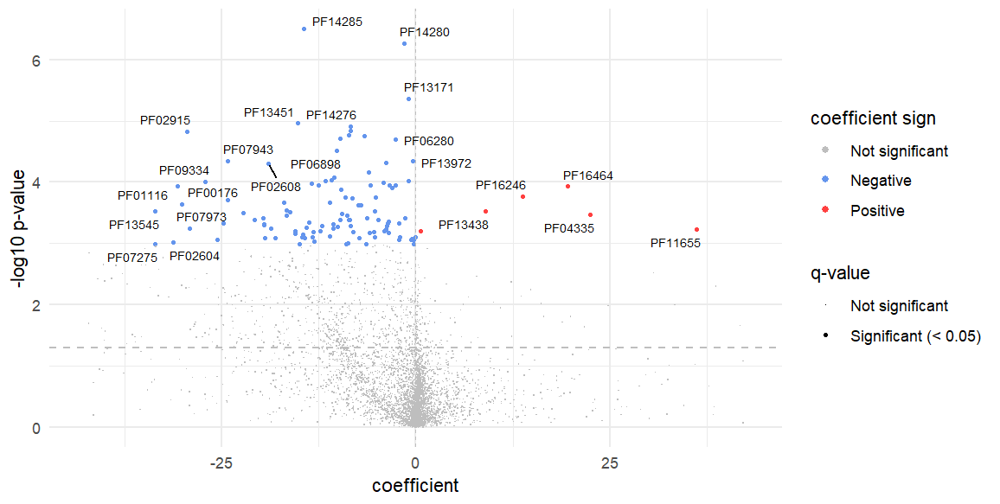
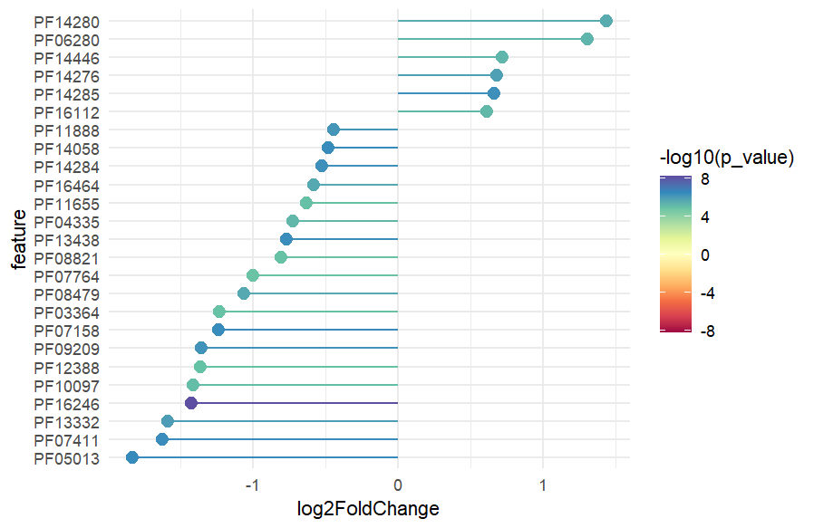

<!-- README.md is generated from README.Rmd. Please edit that file -->

# microfunk

<!-- badges: start -->

[](https://lifecycle.r-lib.org/articles/stages.html#experimental)
[](https://github.com/MicrobialGenomics-IrsicaixaOrg/dar/actions)
[](https://app.codecov.io/gh/MicrobialGenomics-IrsicaixaOrg/dar?branch=devel)
[](https://makeapullrequest.com)
[](https://github.com/MicrobialGenomics-IrsicaixaOrg/dar/issues)
[](https://github.com/MicrobialGenomics-IrsicaixaOrg/dar/pulls)

<!-- badges: end -->

## Introduction

The human microbiome plays a crucial role in health and disease by
affecting important biological processes. Metagenomic analysis of the
microbiome can provide insights into microbial community
composition,functional capabilities and metabolic pathways. Differential
abundance (DA) analysis of annotated features identifies significant
microbial changes across conditions, which is essential for biomarker
discovery and understanding disease mechanisms.

Despite challenges like data sparsity and compositional effects,
specialized statistical methods ensure robust analysis and reliable
results for microbiome data. Nonetheless, existing bioinformatics tools
often lack flexibility, require extensive computational expertise or
fail to provide integrated solutions for both normalization and
differential analysis.

By contrast, `microfunk` offers a streamlined and user-friendly
interface that integrates the steps needed for DA analysis of annotated
microbiome abundance data. It encompasses different functionalities,
including reading HUMAnN3 output files, normalizing gene family and
pathway abundance data, regrouping functional annotations and performing
differential abundance analysis using DESeq2 and MaAsLin2. The inclusion
of visualization tools, such as volcano and lollipop plots, further
enhances the package’s utility by enabling clear and informative
representation of significant findings.

## Installation

You can install the development version of `microfunk` from
[GitHub](https://github.com/) with:

``` r
# install.packages("devtools")
devtools::install_github("MicrobialGenomics-IrsicaixaOrg/microfunk")
```

## Usage

``` r
library(microfunk)

# Example dataset
file_path <- system.file(
                            "extdata", "reduced_genefam_rpk_uniref.tsv", package = "microfunk")
metadata <- system.file("extdata", "ex_meta.csv", package = "microfunk")


# Read HUMAnN3 output file, normalize values to CPM and regroup to PFAM annotation
data <- read_humann(file_path, metadata) %>% 
          norm_abundance(norm = "cpm") %>% 
          humann_regroup(to = "pfam") 
#> ✔ File pfam_v201901b.tsv.gz cached
data
#> class: SummarizedExperiment 
#> dim: 7895 214 
#> metadata(0):
#> assays(1): humann
#> rownames(7895): PF00002 PF00004 ... PF17612 PF17621
#> rowData names(1): id_name
#> colnames(214): RAG_1 RAG_4 ... RAG_48 RAG_20
#> colData names(1): ARM
  
# Perform DA analysis with MaAsLin2
da_maaslin <- run_maaslin2(data, fixed_effects = "ARM")
da_maaslin
#> # A tibble: 6,216 × 11
#>    feature metadata da_method coefficient log2FC stderr lfc_stderr     p_value
#>    <chr>   <chr>    <chr>           <dbl> <chr>   <dbl> <chr>            <dbl>
#>  1 PF14280 ARM      maaslin2       -1.47  -       0.284 -          0.000000547
#>  2 PF14285 ARM      maaslin2      -14.4   -       2.73  -          0.000000319
#>  3 PF13171 ARM      maaslin2       -0.982 -       0.208 -          0.00000438 
#>  4 PF02915 ARM      maaslin2      -29.5   -       6.66  -          0.0000149  
#>  5 PF02943 ARM      maaslin2       -9.70  -       2.22  -          0.0000196  
#>  6 PF04459 ARM      maaslin2       -8.43  -       1.90  -          0.0000145  
#>  7 PF06280 ARM      maaslin2       -2.65  -       0.608 -          0.0000200  
#>  8 PF13451 ARM      maaslin2      -15.2   -       3.38  -          0.0000110  
#>  9 PF14276 ARM      maaslin2       -8.40  -       1.88  -          0.0000122  
#> 10 PF14446 ARM      maaslin2       -6.61  -       1.50  -          0.0000178  
#> # ℹ 6,206 more rows
#> # ℹ 3 more variables: q_value <dbl>, padj_value <chr>, signif <lgl>

# Perform DA analysis with DESeq2
da_deseq <- run_deseq2(data, factor = "ARM")
#> converting counts to integer mode
da_deseq
#> # A tibble: 7,895 × 11
#>    feature metadata da_method coefficient    log2FC stderr lfc_stderr p_value
#>    <chr>   <chr>    <chr>     <chr>           <dbl> <chr>       <dbl>   <dbl>
#>  1 PF00002 ARM      deseq2    -           -0.00150  -         0.176    0.914 
#>  2 PF00004 ARM      deseq2    -            0.00131  -         0.0113   0.414 
#>  3 PF00005 ARM      deseq2    -            0.00157  -         0.0145   0.497 
#>  4 PF00006 ARM      deseq2    -            0.000535 -         0.00806  0.645 
#>  5 PF00008 ARM      deseq2    -           -0.000600 -         0.180    0.954 
#>  6 PF00009 ARM      deseq2    -           -0.000936 -         0.00864  0.406 
#>  7 PF00010 ARM      deseq2    -           -0.00721  -         0.150    0.750 
#>  8 PF00011 ARM      deseq2    -           -0.0222   -         0.0507   0.0318
#>  9 PF00012 ARM      deseq2    -           -0.000668 -         0.00791  0.536 
#> 10 PF00013 ARM      deseq2    -            0.000700 -         0.00644  0.360 
#> # ℹ 7,885 more rows
#> # ℹ 3 more variables: q_value <chr>, padj_value <dbl>, signif <lgl>

# Volcano plot of DA with MaAsLin2
volcano <- plt_volcano(da_maaslin)
```



``` r

# Lollipop plot of DA with DESeq2
lollipop <- plt_lollipop(da_deseq)
#> ! Features present in all methods are greater than the cutoff n = 20
#> ℹ The top 20 significant features will be used
```



## Contributing

- If you think you have encountered a bug, please [submit an
  issue](https://github.com/MicrobialGenomics-IrsicaixaOrg/dar/issues).

- Either way, learn how to create and share a
  [reprex](https://reprex.tidyverse.org/articles/articles/learn-reprex.html)
  (a minimal, reproducible example), to clearly communicate about your
  code.

- Working on your first Pull Request? You can learn how from this *free*
  series [How to Contribute to an Open Source Project on
  GitHub](https://kcd.im/pull-request)

## Code of Conduct

Please note that the `microfunk` project follows a [Contributor Code of
Conduct](https://contributor-covenant.org/version/2/0/CODE_OF_CONDUCT.html).
By contributing to this project, you agree to abide by its terms.
