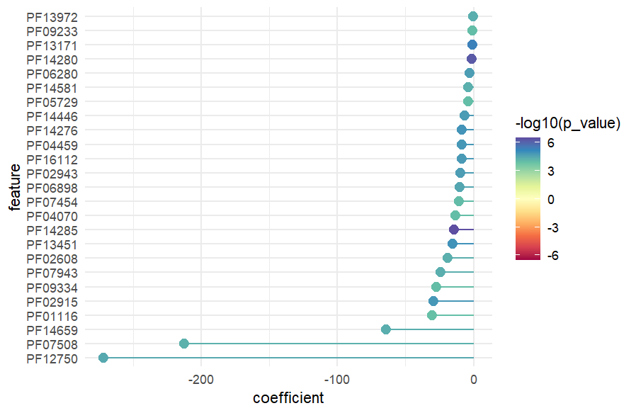

```{=html}
<style>
body {
text-align: justify}
</style>
```
```{r, include = FALSE}
knitr::opts_chunk$set(
  message = FALSE,
  digits = 3,
  collapse = TRUE,
  comment = "#>"
)
options(digits = 3)
```

The following vignette will use a dataset from an HIV study involving
215 patients, where stool samples were collected for DNA extraction and
sequencing on Illumina HiSeq. The resulting FASTQ files were processed
with HUMAnN3 (<https://huttenhower.sph.harvard.edu/humann/>) to generate
functional profiles, annotated with UniRef90. For simplicity and
computational efficiency, the dataset was reduced by filtering out
species-stratified values, retaining only unstratified groups.

## Read HUMAnN3 Output File

First, the `read_humann()` function reads the HUMAnN3 output file, which
contains information about the abundance of gene families annotated with
UniRef90 in a TSV format, and its corresponding metadata (sample
identification and classification into treatment/placebo group) in a CSV
format. `read_humann()` ensures the integrity and accuracy of the input
data and returns a SummarizedExperiment object containing the gene
family abundance values in the assay slot and metadata as the column
data.

```{r read humann}
library(microfunk)

file_path <- system.file(
							"extdata", "reduced_genefam_rpk_uniref.tsv.gz", package = "microfunk")
metadata <- system.file("extdata", "uniref_red_meta.csv", package = "microfunk")

data_uniref <- read_humann(file_path, metadata)

```

## Normalize Abundance Data

Then, the `norm_abundance()` function normalizes the abundance data
stored in the SummarizedExperiment object. This workflow step is not
strictly required, since the user may load data that is already
normalized, or intentionally non-normalized (for instance, because the
DESeq2 analysis method already includes data normalization).

This normalization process aims to convert the data to either CPM units
(copies per million) or relative abundance. The function supports
conversions such as RPK to CPM or relative abundance, relative abundance
to CPM and CPM to relative abundance. `norm_abundance()`returns an
updated SummarizedExperiment object with normalized abundance values in
the assay slot.

In this example, abundance values in the dataset are normalized to
copies per million (CPM).

```{r normalize abundance}
data_uniref_cpm <- norm_abundance(data_uniref, norm = "cpm")

data_uniref_cpm
```

## Regroup Abundance Data

The `humann_regroup()` function regroups the gene family abundance data
stored in the SummarizedExperiment object (either normalized or not) and
annotated with UniRef90 IDs.

It takes as inputs the SummarizedExperiment object, the new annotation
method to regroup to and the version of the database to use, which has
already a default value. This function exclusively operates from
UniRef90 annotations to other annotation types, so that regrouping is
only performed from UniRef90 as the starting point. Available
annotations to regroup to are EC, EggNOG, GO, KEGG and PFAM. This step
is also optional and depends on which specific functional annotations
the user wants to use for performing the differential abundance
analysis.

`humann_regroup()` constructs a new SummarizedExperiment object that
contains the resulting feature ID's and corresponding names of the new
functional annotation as `rowData`.

In this example, the SummarizedExperiment object obtained in the last
step, which contains normalized and UniRef90-annotated abundance values
for gene families, is regrouped to PFAM annotation.

```{r regroup data}
data_pfam_cpm <- humann_regroup(data_uniref_cpm, to = "pfam")

data_pfam_cpm

data_pfam_cpm %>% 
  SummarizedExperiment::rowData() %>% 
  as.data.frame() %>% 
  tibble::rownames_to_column("feature_id") %>% 
  tibble::as_tibble()
```

## Perform Differential Abundance Analysis

`microfunk` provides two different differential abundance analysis
methods for the user to choose: MaAsLin2 and DESeq2. For the purpose of
this vignette, we will provide examples of both methods.

### MaAsLin2

The `run_maaslin2()` function performs a MaAsLin2 analysis, which finds
associations between microbiome meta-omics features and categorical
variables specified in the metadata. In this case, the features consist
on the abundance of gene families of multiple samples, stored in the
SummarizedExperiment object containing normalized abundance values as
the assay and metadata as the column data, as well as several parameter
options to run the analysis. The result of the analysis is returned as a
tibble.

For the `run_maaslin2()` function, most parameters are already set to
default values. The user needs to specify only the SummarizedExperiment
object as input and the categorical variable. If the user wants to see
the complete list of parameters, they can refer to the function's
documentation by using the `?run_maaslin2` command in R.

```{r maaslin2}
da_maaslin <- run_maaslin2(data_pfam_cpm, fixed_effects = "ARM")

da_maaslin
```

### DESeq2

The `run_deseq2()` function performs a DESeq analysis on count data,
which tests for differential expression based on a model using the
Negative Binomial (Gamma-Poisson) Distribution. In our example, the
function takes gene family abundance data for multiple samples and
associated metadata contained in the SummarizedExperiment object, runs
the analysis according to several parameter options and applies
shrinkage to log2-fold changes in order to improve estimate precision.
Finally, it returns a tibble of results indicating significant changes
between the specified experimental conditions.

`run_deseq2()` also takes several parameter values that are already set
to a default. As input for the function, the user must specify the
SummarizedExperiment object and the categorical variable of interest
(`factor`). For a complete list of arguments, please refer to the
function's documentation by running `?run_deseq2` in R.

```{r deseq2}
da_deseq <- run_deseq2(data_pfam_cpm, factor = "ARM")

da_deseq
```

## Visualize Results of Differential Abundance Analysis

`microfunk` offers two visual tools for differential abundance analysis
in microbiome data: lollipop plots and volcano plots. Lollipop plots use
vertical lines to show changes in feature abundance, with markers
indicating statistical significance. Volcano plots display both effect
size and significance on a scatter plot, helping assess the biological
relevance of changes in features. These visualizations assist in
identifying and understanding significant microbial associations
obtained form the differential abundance analysis.

### Volcano Plot

The function `plt_volcano()` generates a volcano plot using the data
from the differential abundance analysis stored in a tibble. The
function distinguishes between results from MaAsLin2 and DESeq2 methods,
ensuring proper formatting based on their respective statistical
outputs.

In the plot, the x-axis represents the coefficient/effect size for
MaAsLin2 or log2FoldChange for DESeq2, indicating the direction and
magnitude of change linked to the categorical variable. The y-axis shows
statistical significance as the negative logarithm of p-values. Each
point on the plot represents a gene family or pathway, positioned by its
effect size and significance level. Significant features (q value \<
0.05 for MaAsLin2 or p-adjusted value \< 0.05 for DESeq2) are
highlighted in red if their abundance increases or blue if it decreases.

The function takes as a single argument the tibble containing the output
from either `run_deseq2()` or `run_maaslin2()`. It returns a ggplot2
object with the volcano plot.

```{r volcano plot}
volcano <- plt_volcano(da_maaslin)
```

{width="768"}

### Lollipop Plot

The function `plt_lollipop()` generates a lollipop plot tailored for
visualizing results from differential abundance analyses conducted with
MaAsLin2 or DESeq2.

It processes data results stored in a tibble format, focusing on
microbial gene families or pathways associated with categorical
variables. This plot highlights significant features (q-value \< 0.05
for MaAsLin2 or p-adjusted value \< 0.05 for DESeq2) by plotting their
coefficient/effect size (MaAsLin2) or log2FoldChange (DESeq2) on the
x-axis, indicating the direction and magnitude of abundance changes
across conditions. Each feature is represented by a line extending from
the origin to its respective coefficient/log2FoldChange value, with the
line's color gradient indicating its statistical significance based on
the negative logarithm of p-values.

The function accepts two arguments: a tibble containing the analysis
results and an optional `n` parameter to limit the number of displayed
significant associations (its default is 20). It returns a ggplot2
object with the lollipop plot.

```{r lollipop plot}
lollipop <- plt_lollipop(da_maaslin, n = 25)
```

{width="547"}

## Session Info

```{r}
devtools::session_info()
```
